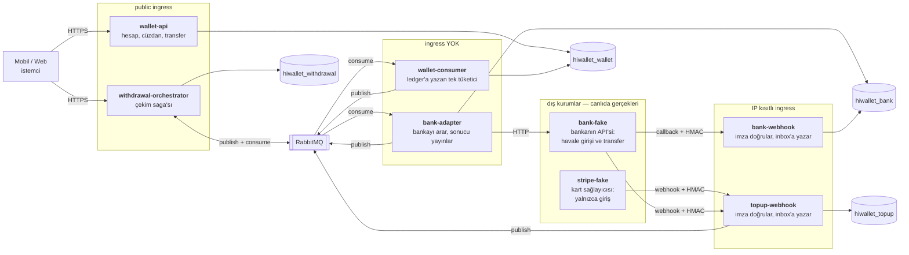
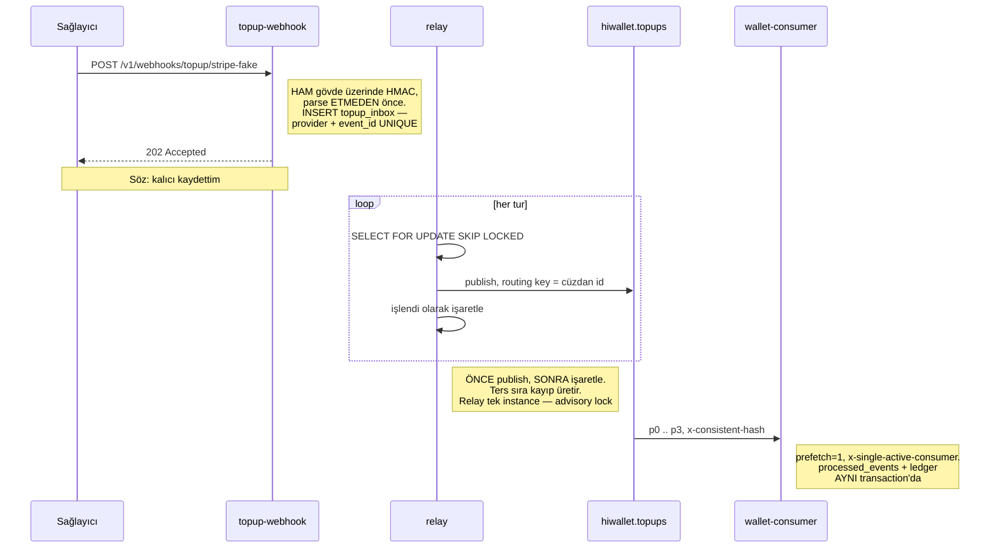
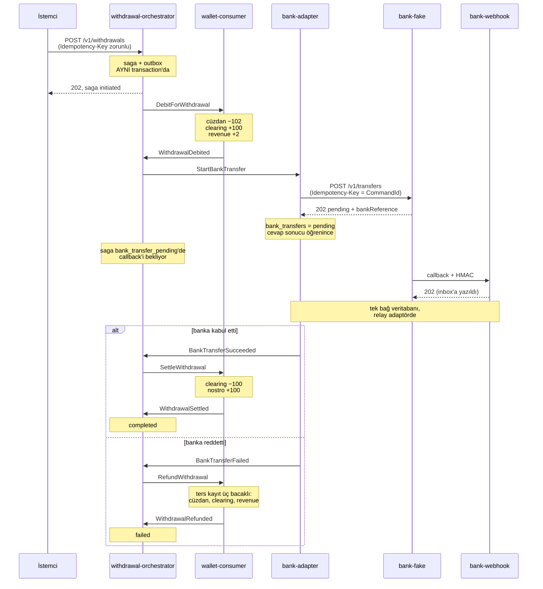
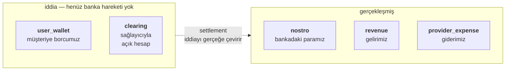

# Mimari — kim ne yapıyor, veri nereye gidiyor

Bu dosya sistemin **şeklini** gösteriyor. Gerekçeler `decisions.md`'de, kurallar
`CLAUDE.md`'de, şema `ledger-schema.md`'de. Kodu okumaya nereden başlanacağı
`README.md`'de.

Diyagramlardaki exchange, kuyruk ve hesap adları koddan alındı; uydurulmuş ad yok.

---

## 1. Topoloji: altı uygulama, dört veritabanı, bir broker

**Ayrım ölçütü erişim seviyesi** (`decisions.md` madde 28). Farklı erişim seviyesi
ayrı process'lere dağılıyor, aynı erişim seviyesi tek process'te toplanıyor:
`wallet-consumer` hem top-up event'lerini hem çekim komutlarını hem settlement'ı
dinliyor; üçü de ingress'siz ve aynı ledger'a yazıyor.

Dikkat edilecek dört şey:

**`wallet-api`'nin broker'a hiç bağlantısı yok.** Public yüzeyin tek bağımlılığı
Postgres. Tüketici ayrı bir uygulamaya taşındıktan sonra bu kasıtlı olarak korunuyor.

**`ledger_entries`'e yazan iki uygulama var** — `wallet-api` ve `wallet-consumer` —
ama **tek kod** üzerinden: `WalletService.Core`. İkinci bir kopya açılmıyor (madde 25).

**Orchestrator wallet'a yalnızca komut gönderiyor**, ledger'a yazan taraf
`wallet-consumer`. Bedeli iki veritabanı arasında ayrışma ihtimali, karşılığı takılmış
saga taraması (madde 33).

**Bankayla iletişim HTTP.** Orchestrator `StartBankTransfer` komutunu RabbitMQ'ya
yazıyor (komutun ayrıntısı bölüm 3'te). `bank-adapter` komutu kuyruktan okuyor ve
bankayı HTTP ile arıyor. Banka sonucu `bank-webhook`'a HTTP callback ile bildiriyor.

`bank-fake` ile `stripe-fake` canlıda yok; adaptörler oradaki adres ayarıyla kurumların
kendi endpoint'lerine bakıyor ve kodda tek satır değişmiyor (madde 35).

`bank-adapter` ile `bank-webhook` ayrı uygulamalar çünkü **erişim seviyeleri farklı**:
birinin IP kısıtlı ingress'i var, öbürünün hiç ingress'i yok. Aralarındaki tek bağ
`hiwallet_bank`; doğrudan çağrı yok.

### İki public yüzey

Müşteriye dönük endpoint'ler iki uygulamada:

| endpoint | uygulama |
| --- | --- |
| `/v1/accounts`, `/v1/wallets`, `/v1/transfers`, `/v1/promos` | `wallet-api` |
| `/v1/withdrawals` | `withdrawal-orchestrator` |

İkisinin erişim seviyesi aynı: public, müşteriye dönük, aynı istemciden çağrılıyor.
Madde 28'in ölçütü onları tek process'te toplardı; ayrı durmalarının sebebi madde 7,
yani orchestrator'ın kendi veritabanı ve kendi sınırı. İki ölçüt çakıştığında servis
sınırı öncelikli.

Bugünkü bedeli: istemci iki base URL biliyor, iki yüzey ayrı ayrı güvenceye alınıyor,
rate-limit'leniyor ve izleniyor. Tek adrese indirmenin iki yolu `decisions.md` madde
33'te tartışılıyor: önüne bir gateway katmanı koymak ya da saga'yı wallet'ın içine
taşımak. İkincisi madde 33'ün elenen alternatifi; referans uygulamasında dağıtık
saga'nın kendisi çıktı olduğu için seçilmedi.

---

## 2. Top-up: para dışarıdan giriyor

**Akışı sağlayıcı başlatıyor.** Müşteri kartıyla ödeme yapıyor ya da banka
hesabımıza havale gönderiyor; parayı alan kurum bunu bize webhook ile bildiriyor.
İlk temas o webhook.

Compose'da bu bildirimi sahte kurumlar üretiyor: `POST :8096/v1/topups` (stripe-fake)
ya da `POST :8094/v1/topups` (bank-fake). İkisi de arkadan `topup-webhook`'a imzalı
webhook gönderiyor — gerçek kurumun yapacağı çağrının aynısı.

`relay`, `topup-webhook`'un içinde koşan bir `BackgroundService`. Diyagramda ayrı
çizilmesinin sebebi akışın orada ikiye ayrılması: HTTP
request'i inbox'a yazıldığında `202` ile bitiyor, yayın ise relay'in sonraki turunda
ve ayrı bir transaction'da oluyor.

Routing key cüzdan kimliği: aynı cüzdanın mesajları hep aynı partition'a düşüyor ve
sıra orada korunuyor. Bu yüzden relay **tek instance** koşuyor — iki relay ayrı
batch'leri farklı hızda yayınlarsa mesajlar exchange'e ters sırada varır ve kuyruk içi
sıra garantisi bunu düzeltmez (madde 30).

İki kademe idempotency var: inbox'ta `(provider, event_id)` UNIQUE, tüketicide
`processed_events`. İkincisi ledger yazımıyla aynı transaction'da.

---

## 3. Çekim: para dışarı çıkıyor

**Akışı müşteri başlatıyor:** `POST /v1/withdrawals`, `withdrawal-orchestrator`
üzerinde, `Idempotency-Key` başlığı zorunlu. Orchestrator saga satırını ve ilk komutu
aynı transaction'da yazıp `202` dönüyor; o an hiçbir para hareket etmiyor. Geri kalan
adımların hepsi kuyruk üzerinden, müşteri beklemeden ilerliyor.

Durumlar: `initiated → debited → bank_transfer_pending → settling → completed`.
Telafi yolu: `debited → compensating → failed`. `rejected` terminal.

**`StartBankTransfer`, kuyruktan geçen bir komut mesajı** (`Shared.Contracts`;
alanları `CommandId`, `SagaId`, `Amount`, `Currency`, `DestinationIban`). Komutu
saga'nın durum değişimi üretiyor: wallet parayı düşüp `WithdrawalDebited` dönünce
saga `debited`'a geçiyor ve orchestrator komutu `withdrawal_outbox`'a bu geçişle
**aynı transaction'da** yazıyor. Outbox relay'i satırı `hiwallet.withdrawals`
exchange'ine `StartBankTransfer` routing key'iyle yayınlıyor;
`hiwallet.withdrawals.bank` kuyruğundan `bank-adapter` tüketiyor. Diğer komutlar da
(`DebitForWithdrawal`, `SettleWithdrawal`, `RefundWithdrawal`) aynı yoldan gidiyor.

**Saga `bank_transfer_pending` durumunda bekliyor.** Banka transferi kabul ettiğini
`202` ile söylüyor, sonucu callback ile sonra bildiriyor. Bekleme süresi bankanın
işleme hızı kadar; takılmış saga taraması (madde 33) bu durumda kalan saga'ları
izliyor.

**Kaçırılan callback'leri mutabakat taraması topluyor.** `bank-adapter`,
`StaleAfter` süresinden uzundur cevapsız kalan transferleri bankaya soruyor. Sonuçların
tamamına yakını callback ile geliyor; taramanın bulduğu satır sayısı callback hattının
sağlık göstergesi (madde 35).

**Ters kayıt orijinal işlemin bacakları okunup negatiflenerek yazılıyor.** Üçü de
geri dönüyor: cüzdan, clearing ve `revenue`. `revenue` bacağı müşterinin ödediği
komisyonu iade ediyor ve bu iade koşulsuz (`CLAUDE.md`, "Withdrawal saga").

**Response'ların hepsi saklanıyor** (`processed_messages`, `bank_transfers`). Aynı
mesaj ikinci kez teslim edildiğinde saklanan response yeniden yayınlanıyor ve saga
ilerlemeye devam ediyor.

---

## 4. Para nerede duruyor

**Her işlemde bacakların toplamı sıfır.** Beş hesap rolü var: ikisi "iddia", üçü
"gerçekleşmiş".

Her işlem tipinin yazdığı bacaklar — **toplamı her satırda sıfır**:

| işlem | bacaklar |
| --- | --- |
| `topup` | `wallet +100`, `clearing −100` |
| `p2p` | `gönderen −100`, `alan +100` |
| `payment` | `gönderen −102`, `alan +100`, `revenue +2` |
| `payment` (promo ile) | `gönderen promo −40`, `gönderen cash −62`, `alan cash +100`, `revenue +2` |
| `promo_grant` (işyeri) | `işyeri cash −40`, `müşteri promo +40` |
| `promo_grant` (kampanya) | `promo_expense −10`, `müşteri promo +10` |
| `promo_expiry` (işyeri fonlu) | `müşteri promo −kalan`, `işyeri cash +kalan` |
| `promo_expiry` (platform fonlu) | `müşteri promo −kalan`, `promo_breakage +kalan` |
| `withdrawal` | `cüzdan −102`, `clearing +100`, `revenue +2` |
| `refund` | orijinalin bacakları negatiflenerek — üçü de |
| `settlement` (top-up) | `clearing +gross`, `nostro −net`; `Net` modelde ayrıca `provider_expense −fee` |
| `settlement` (çekim) | `clearing −owed`, `nostro +owed` |
| `provider_invoice` | `provider_expense −tutar`, `nostro +tutar` |

İşaret konvansiyonu: credit `+`, debit `−`, hiçbir yerde tersine çevrilmiyor.
`nostro` bir **varlık** hesabı ve bu ledger'da varlıklar negatif duruyor: `−97.1`,
bankada 97.1 olduğunu gösteriyor.

`revenue` ile `provider_expense` **netleştirilmiyor**: biri müşteriden aldığımız,
diğeri sağlayıcıya ödediğimiz. Ayrı hesaplar.

`nostro` para birimi başına **tek**: ödeme sağlayıcısının nostro'su yok, çünkü nostro
bir banka hesabı. Stripe parayı bizim banka hesabımıza yatırıyor.

---

## 5. Zamanlanmış işler

| iş | nerede | varsayılan | ne yapıyor |
| --- | --- | --- | --- |
| takılmış saga taraması | orchestrator | 5 dk | iki veritabanı arasında asılı kalan çekimi yakalıyor |
| banka mutabakatı | bank-adapter | 4 saat | callback'i kaçırılmış transferi bankaya sorup kapatıyor |
| mutabakat | wallet-consumer | 6 saat | projeksiyon sapması, gelmeyen settlement, geciken fatura |
| işletme günlük özeti | wallet-consumer | 1 saat | hacim, işlem sayısı, kesilen komisyon |

Dördü de `pg_try_advisory_lock` ile tek instance'a kilitleniyor ve ilk turunu bir
aralık sonra koşuyor; dağıtımda ayağa kalkan instance'lar aynı anda tarama
başlatmıyor.

İki tarama da bir kararın zorunlu tamamlayıcısı: takılmış saga taraması ayrı
orchestrator veritabanının (madde 33), banka mutabakatı asenkron banka sonucunun
(madde 35). Banka mutabakatının aralığı ayarlanabiliyor, kendisi her kurulumda koşuyor.
Kapsamları farklı: biri iki veritabanımız arasındaki ayrışmaya bakıyor, öbürü bizimle
banka arasındakine.
