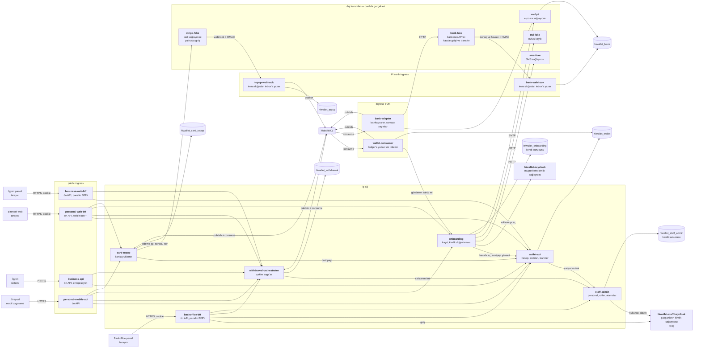
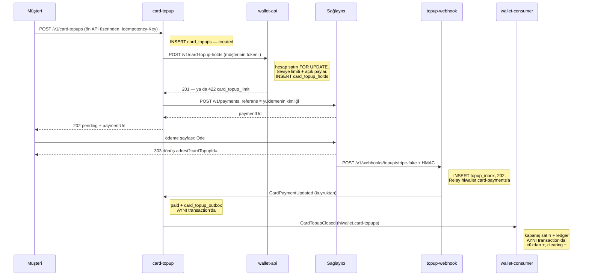
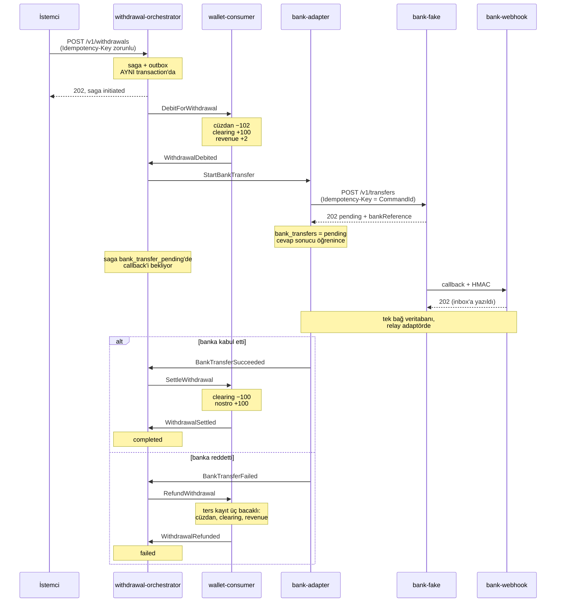
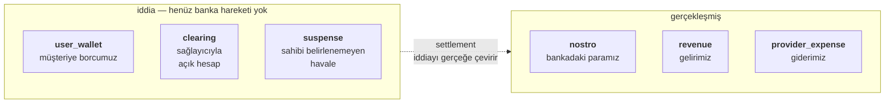

# Mimari — kim ne yapıyor, veri nereye gidiyor

Bu dosya sistemin **şeklini** gösteriyor. Gerekçeler `decisions.md`'de, kurallar
`CLAUDE.md`'de, şema `ledger-schema.md`'de. Kodu okumaya nereden başlanacağı
`README.md`'de.

Diyagramlardaki exchange, kuyruk ve hesap adları koddan alındı; uydurulmuş ad yok.

---

## 1. Topoloji: on dört uygulama, yedi veritabanı, bir broker


```mermaid
flowchart LR
    client["Bireysel<br/>mobil uygulama"]
    wclient["Bireysel web<br/>tarayıcı"]
    bclient["İşyeri<br/>sistemi"]
    bwclient["İşyeri paneli<br/>tarayıcı"]
    staff["Backoffice paneli<br/>tarayıcı"]

    subgraph public["public ingress"]
        papi["<b>personal-mobile-api</b><br/>ön API"]
        pwapi["<b>personal-web-bff</b><br/>ön API, web'in BFF'i"]
        bapi["<b>business-api</b><br/>ön API, entegrasyon"]
        bwapi["<b>business-web-bff</b><br/>ön API, panelin BFF'i"]
    end

    subgraph internal["iç ağ"]
        boapi["<b>backoffice-bff</b><br/>ön API, panelin BFF'i"]
        api["<b>wallet-api</b><br/>hesap, cüzdan, transfer"]
        orch["<b>withdrawal-orchestrator</b><br/>çekim saga'sı"]
        ctop["<b>card-topup</b><br/>kartla yükleme"]
        onb["<b>onboarding</b><br/>kayıt, kimlik doğrulaması"]
        sadm["<b>staff-admin</b><br/>personel, roller, atamalar"]
    end

    subgraph restricted["IP kısıtlı ingress"]
        hook["<b>topup-webhook</b><br/>imza doğrular, inbox'a yazar"]
        bhook["<b>bank-webhook</b><br/>imza doğrular, inbox'a yazar"]
    end

    subgraph noingress["ingress YOK"]
        consumer["<b>wallet-consumer</b><br/>ledger'a yazan tek tüketici"]
        adapter["<b>bank-adapter</b><br/>bankayı arar, sonucu yayınlar"]
    end

    subgraph outside["dış kurumlar — canlıda gerçekleri"]
        bank["<b>bank-fake</b><br/>bankanın API'si:<br/>havale girişi ve transfer"]
        stripe["<b>stripe-fake</b><br/>kart sağlayıcısı:<br/>yalnızca giriş"]
        sms["<b>sms-fake</b><br/>SMS sağlayıcısı"]
        nvi["<b>nvi-fake</b><br/>nüfus kaydı"]
        mail["<b>mailpit</b><br/>e-posta sağlayıcısı"]
    end

    idp["<b>hiwallet-keycloak</b><br/>müşterilerin kimlik sağlayıcısı"]
    sidp["<b>hiwallet-staff-keycloak</b><br/>çalışanların kimlik sağlayıcısı<br/>iç ağ"]

    mq[["RabbitMQ"]]

    wdb[("hiwallet_wallet")]
    tdb[("hiwallet_topup")]
    odb[("hiwallet_withdrawal")]
    cdb[("hiwallet_card_topup")]
    bdb[("hiwallet_bank")]
    ndb[("hiwallet_onboarding<br/>kendi sunucusu")]
    sdb[("hiwallet_staff_admin<br/>kendi sunucusu")]

    client -->|HTTPS| papi
    wclient -->|"HTTPS, cookie"| pwapi
    bclient -->|HTTPS| bapi
    bwclient -->|"HTTPS, cookie"| bwapi
    staff -->|"HTTPS, cookie"| boapi
    boapi -->|"giriş"| sidp
    papi --> api
    papi --> orch
    pwapi --> api
    pwapi --> orch
    papi --> onb
    pwapi --> onb
    papi --> ctop
    pwapi --> ctop
    ctop -->|"limit payı"| api
    ctop -->|"ödeme aç, sonucu sor"| stripe
    onb -->|"hesabı aç, seviyeyi yükselt"| api
    onb -->|"kullanıcıyı aç"| idp
    onb -->|HTTP| sms
    onb -->|HTTP| nvi
    onb -->|SMTP| mail
    onb --> ndb
    bapi --> api
    bapi --> orch
    bwapi --> api
    bwapi --> orch
    boapi --> api
    boapi --> orch
    boapi --> sadm
    api -->|"çalışanın izni"| sadm
    orch -->|"çalışanın izni"| sadm
    sadm -->|"kullanıcı, davet"| sidp
    sadm --> sdb
    stripe -->|"webhook + HMAC"| hook
    bank -->|"sonuç ve havale + HMAC"| bhook
    consumer -->|"gönderen sahip mi"| onb

    api --> wdb
    consumer --> wdb
    hook --> tdb
    orch --> odb
    ctop --> cdb
    adapter --> bdb
    bhook --> bdb

    adapter -->|"HTTP"| bank

    hook -->|publish| mq
    orch <-->|"publish + consume"| mq
    ctop <-->|"publish + consume"| mq
    mq -->|consume| consumer
    consumer -->|publish| mq
    mq -->|consume| adapter
    adapter -->|publish| mq
```


**İstemci yalnızca kendi ön API'sine bağlanıyor**; `wallet-api`, orchestrator, `card-topup`
ve `onboarding` iç servis. Webhook'lar ve ingress'siz uygulamalar erişim seviyesine göre ayrılıyor
(`decisions.md` madde 28): farklı erişim seviyesi ayrı process'lere dağılıyor, aynı
erişim seviyesi tek process'te toplanıyor. `wallet-consumer` kartla yüklemelerin
kapanışlarını, havaleleri, çekim komutlarını ve settlement'ı dinliyor; hepsi ingress'siz ve
aynı ledger'a yazıyor. Havalenin göndereninin hesap sahibi olup olmadığını onboarding'e kendi token'ıyla
soruyor; kimlik numarası wallet'ta tutulmuyor.

Dikkat edilecek dört şey:

**`wallet-api`'nin ve ön API'lerin broker'a hiç bağlantısı yok.** `wallet-api`'nin tek
bağımlılığı Postgres; ön API'lerin veritabanı da yok.

**`ledger_entries`'e yazan iki uygulama var** — `wallet-api` ve `wallet-consumer` —
ama **tek kod** üzerinden: `WalletService.Core`. İkinci bir kopya açılmıyor (madde 25).

**Orchestrator wallet'a yalnızca komut gönderiyor**, ledger'a yazan taraf
`wallet-consumer`. Bedeli iki veritabanı arasında ayrışma ihtimali, karşılığı takılmış
saga taraması (madde 33).

**Bankayla iletişim HTTP.** Orchestrator `StartBankTransfer` komutunu RabbitMQ'ya
yazıyor (komutun ayrıntısı bölüm 3'te). `bank-adapter` komutu kuyruktan okuyor ve
bankayı HTTP ile arıyor. Banka sonucu `bank-webhook`'a HTTP callback ile bildiriyor;
hesabımıza gelen havaleyi de aynı uca bildiriyor.

`bank-fake` ile `stripe-fake` canlıda yok; adaptörler oradaki adres ayarıyla kurumların
kendi endpoint'lerine bakıyor ve kodda tek satır değişmiyor (madde 35).

`bank-adapter` ile `bank-webhook` ayrı uygulamalar çünkü **erişim seviyeleri farklı**:
birinin IP kısıtlı ingress'i var, öbürünün hiç ingress'i yok. Aralarındaki tek bağ
`hiwallet_bank`; doğrudan çağrı yok.

### Ön API'ler

İstemcinin gördüğü tek adres kendi ön API'si:

| istemci | ön API | erişim | arkasında |
| --- | --- | --- | --- |
| bireysel mobil uygulama | `personal-mobile-api` | public | `wallet-api`, `withdrawal-orchestrator`, `onboarding` |
| bireysel web uygulaması (tarayıcı) | `personal-web-bff` | public | `wallet-api`, `withdrawal-orchestrator`, `onboarding` |
| işyerinin sistemi | `business-api` | public | `wallet-api`, `withdrawal-orchestrator` |
| işyeri paneli (tarayıcı) | `business-web-bff` | public | `wallet-api`, `withdrawal-orchestrator` |
| backoffice paneli (tarayıcı) | `backoffice-bff` | iç ağ | `wallet-api`, `withdrawal-orchestrator` |

Ön API veritabanına ve broker'a bağlanmıyor; isteği iç servise iletiyor. İç servisin
reddi (400, 404, 409, 422) istemciye aynen dönüyor; iç servise ulaşılamazsa istemci
`503` alıyor. Müşteri başına rate limit ön API'de, iç servislerde değil.
`wallet-api`'nin uçları (`/v1/accounts`, `/v1/wallets`, `/v1/transfers`, `/v1/promos`)
ve orchestrator'ın `/v1/withdrawals` ucu iç sözleşme. Yeni bir istemci grubu kendi ön
API'siyle geliyor; ihtiyaca göre public ya da yalnızca iç ağdan erişiliyor.

Tarayıcıdan kullanılan arayüzün ön API'si BFF: token'ı tarayıcıdaki koda vermiyor,
tarayıcı yalnızca HttpOnly oturum cookie'si taşıyor. Bu yüzden müşterinin ve işyerinin
ikişer ön API'si var: mobil uygulama `personal-mobile-api`'ye, tarayıcıdaki uygulama
`personal-web-bff`'ye; token taşıyan sistem entegrasyonu `business-api`'ye, tarayıcıdaki
panel `business-web-bff`'ye bağlanıyor.

`personal-mobile-api` ve `personal-web-bff`'nin uçları aynı: kayıt ve doğrulama, hesap ve
seviye limitleri, cüzdan, hareketler, promo partileri, transfer, çekim ve cüzdanın çekimleri. Hesap ön API'den açılmıyor, kayıt
açıyor. Web uygulamasının sayfalarını da `personal-web-bff` sunuyor
(`src/personal/edge/PersonalWeb`). `business-api`'nin uçları: hesap, cüzdan, hareketler,
transfer (`B2P`, `B2B`), müşteriye promo ve çekim. `backoffice-bff`'in uçları: müşteri
kaydını, seviye limitlerini ve cüzdanın çekimlerini görüntüleme, çekim incelemesi, işyerinin promo kabulü, personel promo'su,
kampanyalar ve personel yönetimi; her biri kendi izniyle. Panelin sayfalarını da o
sunuyor (`src/backoffice/edge/BackofficeWeb`).
`business-web-bff` sağlık uçlarıyla ayakta.

### Kimlik

Token'ı Keycloak imzalıyor. Mobil uygulama kimlik sağlayıcıdan token alıp ön API'ye
getiriyor; ön API token'ı doğruluyor ve iç servise AYNEN iletiyor. `wallet-api` ve
orchestrator token'ı yeniden doğruluyor: ön API'nin beyanına değil token'a bakıyorlar,
yani ele geçirilmiş bir ön API başkası adına istek yazdıramıyor.

```
mobil uygulama ──token──▶ personal-mobile-api ──aynı token──▶ wallet-api / orchestrator
                           doğrular                           yeniden doğrular, sahipliği kontrol eder
```

Tarayıcıda token yok. Girişi BFF yapıyor: Keycloak'la kod akışı ve PKCE, kendi gizli
anahtarlı istemcisiyle. Token'lar cookie'nin içinde BFF'in anahtarıyla şifreli; iç
servise giden istek token'ı oradan okuyor. Access token dolmak üzereyken BFF onu
yeniliyor ve cookie'yi yeniden yazıyor.

```
tarayıcı ──cookie──▶ personal-web-bff ──oturumdaki token──▶ wallet-api / orchestrator
                     çözer, gerekirse yeniler                yeniden doğrular, sahipliği kontrol eder
```

Her ön API yalnızca kendisi için verilmiş token'ı kabul ediyor: token'ın hedef
kitlesinde ön API'nin adı ve iç servislerin ortak adı (`hiwallet-api`) var. Mobil
uygulama token'ı kullanıcının girişiyle alıyor; işyerinin sistemi kendi istemcisinin
gizli anahtarıyla (client credentials) ve token'daki kimlik o istemcinin servis hesabı.

Hangi kimliğin hangi hesabın kullanıcısı olduğu wallet'ta (`account_members`); hesabı
açan kimlik hesabın kullanıcısı oluyor. İşyeri hesabı ön API'den açılmıyor; işyerinin
entegrasyonu hesaba backoffice'ten bağlanacak. `wallet-api` her uçta çağıranın kaynağın
kullanıcısı olduğunu kontrol ediyor; değilse kaynak yokmuş gibi `404`. Orchestrator
hesabın kullanıcılarını bilmiyor: çekimi isteyen kimliği saga'ya yazıyor, düşme
komutuyla wallet'a gönderiyor ve wallet ledger'a yazmadan önce üyeliği doğruluyor.

Çalışanların kimlik sağlayıcısı müşterilerinkinden ayrı bir Keycloak kurulumu
(`hiwallet-staff-keycloak`, realm'i `hiwallet-staff`): kendi veritabanı sunucusu, kendi
yöneticisi. Müşterilerin Keycloak'ının yöneticisi çalışan açamıyor, çalışanlarınkinin
yöneticisi müşteriye dokunamıyor. Çalışanın girişi ve paneli yalnızca iç ağdan
erişiliyor. Kayıt sayfası yok, çalışanı panelden bir yönetici davet ediyor ve girişte tek
kullanımlık kod (TOTP) zorunlu. Giriş ve kodun kurulumu Keycloak'ın sayfasında, müşterininkiyle aynı
HiWallet temasıyla. Çalışan backoffice panelinden giriyor; `backoffice-bff` oturumdaki
çalışan token'ını iç servise iletiyor.

```
tarayıcı ──cookie──▶ backoffice-bff ──çalışanın token'ı──▶ wallet-api / orchestrator
                     izni yoksa reddeder                 issuer'a göre doğrular, izni kontrol eder
```

İç servisler iki Keycloak'ın token'ını da kabul ediyor; token'ın hangisinden geldiğini
onu doğrulayan şema söylüyor, token'ın içeriği değil. Varsayılan politika çalışanı
dışarıda bırakıyor: yeni bir uç kendiliğinden çalışana kapalı. Çalışanın yetkisi izinle
kontrol ediliyor: `customer.view` ile her müşterinin kaydını görüntüleyebiliyor, üyelik
aranmıyor. Müşterinin para hareketi başlatan uçları çalışana kapalı; çalışanın yazma
işleri kendi uçlarında, kendi iznine bağlı ve ledger'a çalışanın aktörüyle düşüyor. Müşterinin ön API'leri çalışanların Keycloak'ını tanımıyor.

### Personel yönetimi

İzinler kodda ve sabit (`StaffPermissions`): müşteri kaydını görüntüleme, çekim incelemesi,
personel promo'su, kampanyaları görüntüleme ve yönetme, işyerinin promo kabulü, personel
yönetimi. Roller panelde tanımlanıyor; rol bir izin seti, çalışan bir ya da birden fazla
rol alıyor. Roller, çalışanlar ve atamalar `staff-admin`'in veritabanında. Keycloak'ta
yalnızca kullanıcı, parola, OTP ve oturum var; çalışanın token'ı kim olduğunu söylüyor,
izin taşımıyor.

```
panel ──cookie──▶ backoffice-bff ──çalışanın token'ı──▶ staff-admin ──servis hesabı──▶ hiwallet-staff-keycloak
                                                         │                              kullanıcı, parola, OTP
                                                         └──▶ staff-admin-postgres
                                                              çalışanlar, roller, atamalar, kayıt

wallet-api, orchestrator ──GET /v1/me, çalışanın token'ıyla──▶ staff-admin
```

Çalışanın izni her istekte o anki haliyle okunuyor: `wallet-api` ve orchestrator çalışan
izni isteyen her uçta `staff-admin`'in `GET /v1/me` ucuna soruyor, çalışanın kendi
token'ıyla; `staff-admin` kendi uçlarında veritabanına bakıyor. Önbellek yok: rolü alınan
ya da kapatılan çalışanın aynı token'la gelen bir sonraki isteği reddediliyor. `staff-admin`'e
ulaşılamazsa çalışanın isteği `503` alıyor; müşterinin istekleri etkilenmiyor. Panel menüyü
ve düğmeleri aynı uçtan okuyor ve bir istek `403` alınca yeniden soruyor.

`staff-admin` yalnızca çalışanların Keycloak'ının token'ını tanıyor; `GET /v1/me` dışındaki
her ucu `staff.manage` istiyor. Çalışan kendine yetki veremiyor: kendi rollerini, sahip
olduğu rolün izinlerini değiştiremiyor ve kendini kapatamıyor. Yeni çalışan davetle
geliyor; parolasını ve OTP'sini davetteki bağlantıdan kendisi kuruyor, ilk girişiyle davet
tamamlanmış sayılıyor. Her değişiklik işi yapan çalışanla, değişiklikle aynı transaction'da
kayda yazılıyor. Açılışta servis yönetici rolünü kuruyor; kimsede personel yönetimi yoksa
ayardaki adrese ilk yönetici daveti gönderiyor. Keycloak'ın konsoluna personel işi için
girilmiyor; konsolda açılan kullanıcının hiçbir izni yok.

`wallet-api` ile orchestrator'ın ayrı durmasının sebebi madde 7: orchestrator'ın kendi
veritabanı ve kendi sınırı var.

### Kayıt ve doğrulama

Kaydı `onboarding` yürütüyor; ön API'ler kayıt uçlarını kimliksiz, doğrulama uçlarını
müşterinin token'ıyla ona iletiyor. Keycloak'ta kendi kendine kayıt kapalı: müşterinin
kullanıcısını onboarding açıyor, kendi istemcisinin servis hesabıyla yönetim API'sinden.
Giriş yine Keycloak'ın sayfasında, HiWallet temasıyla.

```
kayıt:  e-posta ──▶ kod (e-postayla) ──▶ parola ──▶ Keycloak'ta kullanıcı ──▶ wallet'ta hesap (Unknown)
giriş:  Keycloak'ın sayfası, e-posta dolu
temel:  telefon (SMS kodu) ──▶ kimlik (nüfus kaydı) ──▶ sözleşme ve aydınlatma metni ──▶ Unverified
```

E-posta parola sorulmadan doğrulanıyor; parola yalnızca kullanıcıyı açan istekte geçiyor,
hiçbir yerde saklanmıyor. Kişisel veri (e-posta, telefon, TCKN, doğum tarihi, onaylar)
onboarding'in kendi Postgres sunucusunda; wallet yalnızca sonucu, hesabın seviyesini
biliyor. Bireysel hesabı ve seviyeyi yalnızca onboarding değiştirebiliyor: wallet-api'de
bu uçlar token'ın `azp`'sinde onboarding'in istemcisini arıyor.

| seviye | ne doğrulandı | ayda ne kadar |
| --- | --- | --- |
| `Unknown` | hiçbir şey: kayıt tamamlandı | hiçbir hareket |
| `Unverified` | bilgiler: telefon, nüfus kaydı, onaylar | yükleme, gelen transfer ve işyerine ödeme; giden transfer ve çekim yok |
| `Verified` | kişi, otomatik: uzaktan kimlik tespiti (kimlik kartının çipi, canlılık, yüz) | hepsi, orta limit |
| `Contracted` | kişi, bir çalışan tarafından: görüntülü görüşme ya da yüz yüze, sözleşme | hepsi, en yüksek limit |

`Unknown` ve `Unverified` kimliği tespit edilmemiş müşteri: ayın toplam girişi (yükleme ve
gelen transfer birlikte) ve bakiye yasal tavanın altında (MASAK Genel Tebliği Sıra No 5,
2.2.11; bugün 5.500 TL). `Verified` ve `Contracted`'ın tavanı yok, tutarları risk kararı.

Tutarlar wallet-api'nin (transfer, ödeme) ve wallet-consumer'ın (çekim, yükleme) ayarında.
Seviye yalnızca yükseliyor. `Verified` ve `Contracted`'a geçiş henüz yok. Kendi hesabından
gelen havale seviye değiştirmiyor: kimlik tespiti değil.

---

## 2. Yükleme: para dışarıdan giriyor

### Kartla yükleme

**Akışı müşteri başlatıyor:** uygulamada tutarı yazıp "Kartla yükle" diyor. Kart limitte
öncelikli: ödeme açılmadan önce wallet seviye limitinden pay ayırıyor; limit yetmiyorsa
ödeme hiç açılmıyor ve kart çekilmiyor. Pay açık kaldıkça hesaba gelen her para
(havale, transfer, başka kart yüklemesi) onunla birlikte sayılıyor.

Compose'da kart sağlayıcısının yerinde `stripe-fake` duruyor: ödemeyi açıyor, ödeme
sayfasını sunuyor ve sonucu `topup-webhook`'a imzalı webhook'la bildiriyor — gerçek kurumun
yapacağı çağrıların aynısı.


```mermaid
sequenceDiagram
    participant M as Müşteri
    participant T as card-topup
    participant W as wallet-api
    participant P as Sağlayıcı
    participant H as topup-webhook
    participant C as wallet-consumer

    M->>T: POST /v1/card-topups (ön API üzerinden, Idempotency-Key)
    Note right of T: INSERT card_topups — created
    T->>W: POST /v1/card-topup-holds (müşterinin token'ı)
    Note right of W: hesap satırı FOR UPDATE.<br/>Seviye limiti + açık paylar.<br/>INSERT card_topup_holds
    W-->>T: 201 — ya da 422 card_topup_limit
    T->>P: POST /v1/payments, referans = yüklemenin kimliği
    P-->>T: paymentUrl
    T-->>M: 202 pending + paymentUrl
    M->>P: ödeme sayfası: Öde
    P-->>M: 303 dönüş adresi?cardTopupId=
    P->>H: POST /v1/webhooks/topup/stripe-fake + HMAC
    Note right of H: INSERT topup_inbox, 202.<br/>Relay hiwallet.card-payments'a
    H->>T: CardPaymentUpdated (kuyruktan)
    Note right of T: paid + card_topup_outbox<br/>AYNI transaction'da
    T->>C: CardTopupClosed (hiwallet.card-topups)
    Note right of C: kapanış satırı + ledger<br/>AYNI transaction'da:<br/>cüzdan +, clearing −
```

**Başlatmanın üç adımı ayrı commit'ler:** kayıt, pay, ödeme. Kayıt önce: süreç pay alındıktan
sonra ölse bile pay sahipsiz kalmıyor. Pay ve ödeme yüklemenin kimliğiyle tekil; aynı
`Idempotency-Key` ile tekrar eden istek yarım kalan adımı tamamlıyor. wallet-api'nin reddi
(`422 card_topup_limit` gibi) ön API'den müşteriye aynen gidiyor.

**Kapanış iki yoldan gelebilir.** Bildirim asıl yol. Oturumun süresi dolduğunda sağlayıcı
bildirim göndermiyor; card-topup'ın taraması oturumu kapanmış yüklemeyi sağlayıcıya sorup
kapatıyor, bildirimi kaçırılmış ödemeyi de böyle buluyor. Ödenmedi kapanışında ledger'a
hiçbir şey yazılmıyor, yalnızca pay kapanıyor. Pay saatle düşmüyor.

`topup-webhook`'un relay'i **tek instance** koşuyor: iki relay ayrı batch'leri farklı hızda
yayınlarsa aynı ödemenin bildirimleri exchange'e ters sırada varır ve kuyruk içi sıra
garantisi bunu düzeltmez (madde 30).

Idempotency her halkada: inbox'ta `(provider, event_id)` UNIQUE, card-topup'ta yüklemenin
durumu (aynı sonucun ikinci bildirimi `Ignored`), wallet'ta kapanış satırı ledger'la aynı
transaction'da ve ledger anahtarı `provider:card_topup_id` (madde 27).

### Havale ile yükleme

**Akışı müşteri başlatıyor:** kendi bankasından bankadaki toplama hesabımıza havale ya da
FAST gönderiyor, açıklamaya hesap numarasını yazıyor. IBAN'ı, alıcı adını ve numarayı
uygulamanın "Havaleyle para yükle" sayfası veriyor
(`GET /v1/accounts/{id}/deposit-instructions`). Bütün müşteriler aynı IBAN'a gönderiyor.

Banka parayı açıklamaya bakmadan kabul ediyor ve bize bildiriyor; bildirim geldiğinde para
zaten bankamızda. Compose'da havaleyi sahte banka tetikliyor:
`POST :8094/v1/incoming-transfers`.

```
bank-fake ──bildirim──▶ bank-webhook ──▶ bank_callbacks ──▶ bank-adapter ──▶ bank_deposits
                        (IP kısıtlı)      (inbox)           (yorumlayıcı)    (kayıt + outbox)
                                                                │
           hesap hareketleri ◀──── tarama (kaçırılan bildirim) ─┘
                                                                │ DepositRelay
                                                                ▼
                                                     hiwallet.deposits ──▶ wallet-consumer
                                                                                │
                              açıklamadaki numara ──▶ hesap ──▶ onboarding'e TCKN sorusu
                                                                                │
                                             cüzdan +, nostro −   ya da   askı +, nostro −
```

- **Banka tarafı.** Banka iki tür bildirimi aynı uca gönderiyor; gövdedeki `type` transfer
  sonucunu (`transfer.status`) gelen havaleden (`transfer.incoming`) ayırıyor. Havale
  `bank_deposits`'e yazılıyor; wallet'a gidecek mesaj satırla birlikte saklanıyor ve
  `DepositRelay` yayınlıyor. Kaçırılan bildirimi hesap hareketi taraması buluyor; tarama
  kapatılamaz, bulduğu her havale bildirim hattında sorun olabileceğini söylüyor.
- **Kişisel veri.** Gönderenin adı, IBAN'ı ve kimlik numarası `bank_deposits`'te kalıyor.
  Wallet'a giden mesajda ad ve IBAN yok; kimlik numarası yalnızca onboarding'e sorulmak
  için geçiyor, wallet onu yazmıyor.
- **Karar wallet'ta.** Cüzdana yalnızca açıklamasında tek geçerli hesap numarası olan,
  bireysel hesabın, gönderenin kimlik numarası hesap sahibininkiyle aynı ve seviye limitine
  sığan havale geçiyor; para varsayılan cüzdana düşüyor. Geri kalanı askıya alınıyor ve
  sebebi `suspended_deposits`'te. Askıdaki havaleleri panel listeliyor
  (`deposit.view` izni); kaynağa iade ve elle aktarma sonraki adım.
- **Sıra.** Havale kuyruğunda tek aktif tüketici var: aynı hesaba gelen iki havale
  seviyenin aylık limitini ayrı ayrı yeterli görmesin. Onboarding cevap vermezse havale
  kuyruğa dönüyor.

---

## 3. Çekim: para dışarı çıkıyor

**Akışı müşteri başlatıyor:** `POST /v1/withdrawals`, `withdrawal-orchestrator`
üzerinde, `Idempotency-Key` başlığı zorunlu. Orchestrator saga satırını ve ilk komutu
aynı transaction'da yazıp `202` dönüyor; o an hiçbir para hareket etmiyor. Geri kalan
adımların hepsi kuyruk üzerinden, müşteri beklemeden ilerliyor.


```mermaid
sequenceDiagram
    participant U as İstemci
    participant O as withdrawal-orchestrator
    participant W as wallet-consumer
    participant A as bank-adapter
    participant B as bank-fake
    participant H as bank-webhook

    U->>O: POST /v1/withdrawals<br/>(Idempotency-Key zorunlu)
    Note over O: saga + outbox<br/>AYNI transaction'da
    O-->>U: 202, saga initiated

    O->>W: DebitForWithdrawal
    Note over W: cüzdan −102<br/>clearing +100<br/>revenue +2
    W->>O: WithdrawalDebited

    O->>A: StartBankTransfer
    A->>B: POST /v1/transfers<br/>(Idempotency-Key = CommandId)
    B-->>A: 202 pending + bankReference
    Note over A: bank_transfers = pending<br/>cevap sonucu öğrenince
    Note over O: saga bank_transfer_pending'de<br/>callback'i bekliyor

    B->>H: callback + HMAC
    H-->>B: 202 (inbox'a yazıldı)
    Note over H,A: tek bağ veritabanı,<br/>relay adaptörde

    alt banka kabul etti
        A->>O: BankTransferSucceeded
        O->>W: SettleWithdrawal
        Note over W: clearing −100<br/>nostro +100
        W->>O: WithdrawalSettled
        Note over O: completed
    else banka reddetti
        A->>O: BankTransferFailed
        O->>W: RefundWithdrawal
        Note over W: ters kayıt üç bacaklı:<br/>cüzdan, clearing, revenue
        W->>O: WithdrawalRefunded
        Note over O: failed
    end
```

Durumlar: `initiated → debited → bank_transfer_pending → settling → completed`.
Telafi yolu: `debited → compensating → failed`. `rejected` terminal.

Tutarı inceleme eşiğinin üstündeki çekim (`Withdrawals:Review:Above`, TRY için 10.000)
düşüldükten sonra bankaya gitmiyor: `debited → under_review`. Operasyon rolünden bir
çalışan serbest bırakıyor (`under_review → bank_transfer_pending`, banka komutu o anda
üretiliyor) ya da iptal ediyor (`under_review → cancelling → cancelled`; ters kaydın
aktörü iptal eden çalışan). İncelemedeki saga takılmış saga taramasına girmiyor.

**`StartBankTransfer`, kuyruktan geçen bir komut mesajı** (`Shared.Contracts`;
alanları `CommandId`, `SagaId`, `Amount`, `Currency`, `DestinationIban`). Komutu
saga'nın durum değişimi üretiyor: wallet parayı düşüp `WithdrawalDebited` dönünce
saga `debited`'a geçiyor ve orchestrator komutu `withdrawal_outbox`'a bu geçişle
**aynı transaction'da** yazıyor. Outbox relay'i satırı `hiwallet.withdrawals`
exchange'ine `StartBankTransfer` routing key'iyle yayınlıyor;
`hiwallet.withdrawals.bank` kuyruğundan `bank-adapter` tüketiyor. Diğer komutlar da
(`DebitForWithdrawal`, `SettleWithdrawal`, `RefundWithdrawal`) aynı yoldan gidiyor.

**Saga `bank_transfer_pending` durumunda bekliyor.** Banka transferi kabul ettiğini
`202` ile söylüyor, sonucu callback ile sonra bildiriyor. Bekleme süresi bankanın
işleme hızı kadar; takılmış saga taraması (madde 33) bu durumda kalan saga'ları
izliyor.

**Kaçırılan callback'leri mutabakat taraması topluyor.** `bank-adapter`,
`StaleAfter` süresinden uzundur cevapsız kalan transferleri bankaya soruyor. Sonuçların
tamamına yakını callback ile geliyor; taramanın bulduğu satır sayısı callback hattının
sağlık göstergesi (madde 35).

**Ters kayıt orijinal işlemin bacakları okunup negatiflenerek yazılıyor.** Üçü de
geri dönüyor: cüzdan, clearing ve `revenue`. `revenue` bacağı müşterinin ödediği
komisyonu iade ediyor ve bu iade koşulsuz (`CLAUDE.md`, "Withdrawal saga").

**Response'ların hepsi saklanıyor** (`processed_messages`, `bank_transfers`). Aynı
mesaj ikinci kez teslim edildiğinde saklanan response yeniden yayınlanıyor ve saga
ilerlemeye devam ediyor.

---

## 4. Para nerede duruyor

**Her işlemde bacakların toplamı sıfır.** Altı hesap rolü var: üçü "iddia", üçü
"gerçekleşmiş".


```mermaid
flowchart LR
    subgraph claim["iddia — henüz banka hareketi yok"]
        wallet["<b>user_wallet</b><br/>müşteriye borcumuz"]
        clearing["<b>clearing</b><br/>sağlayıcıyla<br/>açık hesap"]
        suspense["<b>suspense</b><br/>sahibi belirlenemeyen<br/>havale"]
    end

    subgraph real["gerçekleşmiş"]
        nostro["<b>nostro</b><br/>bankadaki paramız"]
        revenue["<b>revenue</b><br/>gelirimiz"]
        expense["<b>provider_expense</b><br/>giderimiz"]
    end

    claim -.->|settlement<br/>iddiayı gerçeğe çevirir| real
```

Her işlem tipinin yazdığı bacaklar — **toplamı her satırda sıfır**:

| işlem | bacaklar |
| --- | --- |
| `topup` (kart) | `wallet +100`, `clearing −100` |
| `topup` (havale) | `wallet +100`, `nostro −100` |
| `suspended_deposit` | `suspense +100`, `nostro −100` |
| `p2p` | `gönderen −100`, `alan +100` |
| `payment` | `gönderen −102`, `alan +100`, `revenue +2` |
| `payment` (promo ile) | `gönderen promo −40`, `gönderen cash −62`, `alan cash +100`, `revenue +2` |
| `promo_grant` (işyeri) | `işyeri cash −40`, `müşteri promo +40` |
| `promo_grant` (kampanya) | `promo_expense −10`, `müşteri promo +10` |
| `promo_expiry` (işyeri fonlu) | `müşteri promo −kalan`, `işyeri cash +kalan` |
| `promo_expiry` (platform fonlu) | `müşteri promo −kalan`, `promo_breakage +kalan` |
| `withdrawal` | `cüzdan −102`, `clearing +100`, `revenue +2` |
| `refund` | orijinalin bacakları negatiflenerek — üçü de |
| `settlement` (top-up) | `clearing +gross`, `nostro −net`; `Net` modelde ayrıca `provider_expense −fee` |
| `settlement` (çekim) | `clearing −owed`, `nostro +owed` |
| `provider_invoice` | `provider_expense −tutar`, `nostro +tutar` |

İşaret konvansiyonu: credit `+`, debit `−`, hiçbir yerde tersine çevrilmiyor.
`nostro` bir **varlık** hesabı ve bu ledger'da varlıklar negatif duruyor: `−97.1`,
bankada 97.1 olduğunu gösteriyor.

`revenue` ile `provider_expense` **netleştirilmiyor**: biri müşteriden aldığımız,
diğeri sağlayıcıya ödediğimiz. Ayrı hesaplar.

`nostro` para birimi başına **tek**: ödeme sağlayıcısının nostro'su yok, çünkü nostro
bir banka hesabı. Stripe parayı bizim banka hesabımıza yatırıyor.

---

## 5. Zamanlanmış işler

| iş | nerede | varsayılan | ne yapıyor |
| --- | --- | --- | --- |
| takılmış saga taraması | orchestrator | 5 dk | iki veritabanı arasında asılı kalan çekimi yakalıyor |
| açık yükleme taraması | card-topup | 1 dk | oturumu kapanmış ödemeyi sağlayıcıya sorup kapatıyor, terk edilmiş yüklemeyi kapatıyor |
| banka mutabakatı | bank-adapter | 4 saat | callback'i kaçırılmış transferi bankaya sorup kapatıyor |
| hesap hareketi taraması | bank-adapter | 4 saat | bildirimi kaçırılmış havaleyi hesap hareketlerinden bulup kaydediyor |
| mutabakat | wallet-consumer | 6 saat | projeksiyon sapması, gelmeyen settlement, geciken fatura |
| işletme günlük özeti | wallet-consumer | 1 saat | hacim, işlem sayısı, kesilen komisyon |

Hepsi `pg_try_advisory_lock` ile tek instance'a kilitleniyor ve ilk turunu bir
aralık sonra koşuyor; dağıtımda ayağa kalkan instance'lar aynı anda tarama
başlatmıyor.

Üç tarama bir kararın zorunlu tamamlayıcısı: takılmış saga taraması ayrı
orchestrator veritabanının (madde 33), banka mutabakatı asenkron banka sonucunun
(madde 35), açık yükleme taraması sağlayıcının süresi dolan ödemeyi bildirmemesinin.
Aralıkları ayarlanabiliyor, kendileri her kurulumda koşuyor.
Kapsamları farklı: biri iki veritabanımız arasındaki ayrışmaya bakıyor, öbürü bizimle
banka arasındakine.
